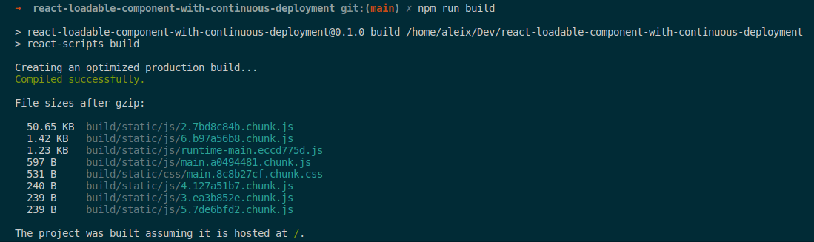

# react-loadable-component-with-continuous-deployment

React @loadable/component with Continuous Deployment

## Project Docs

- [React Instructions](./doc/react-instructions.md)

## Decisions

- It's a [Single-Page Application][spa]
- We need [@loadable/component][lc] library to reduce the application first loading size
- We  don't want to store the previous artifacts (js & css) between deployments to keep old versions working
- We want Continuous Deployment

## Problem

Let's try do build the project twice changing a little a file:

__Build 1__

__Build 2__

As you see, some file names changed as they contain the checksum in the name to verify that the content has changed.

__See example video of the behavior__

## Solution

Wrap the Router file with a `ErrorBoundary` component that caches the `'ChunkLoadError'` thrown by `@loadable/component` and asks the user to reload the page.

You add this [ErrorBoundary](./src/ErrorBoundary.jsx) file to your project, and then you wrap the `<Router>...</Router>` Component with it. [See example here](https://github.com/aleixmorgadas/react-loadable-component-with-continuous-deployment/blob/main/src/App.js#L18-L19)

__See example of the correct behavior__

[spa]: https://en.wikipedia.org/wiki/Single-page_application
[lc]: https://github.com/gregberge/loadable-components#readme